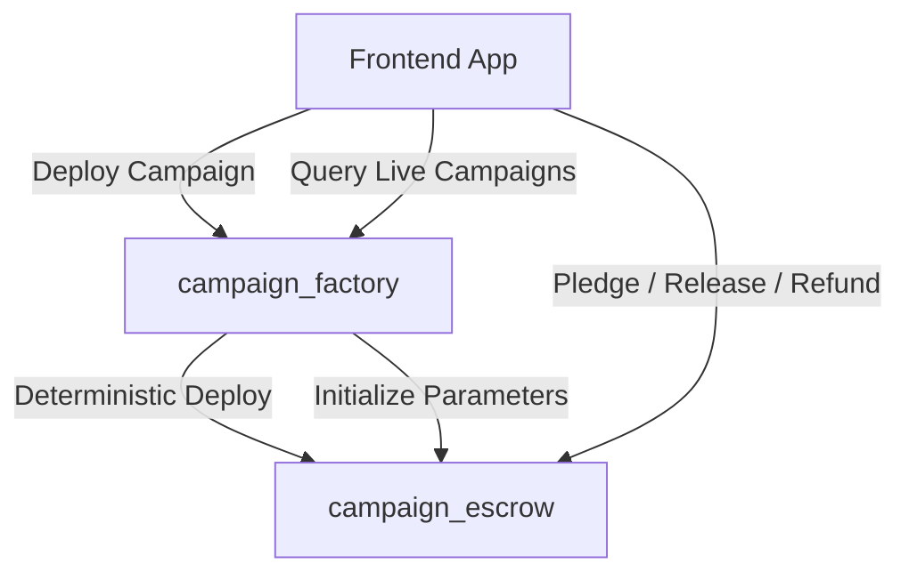

# Stellar Escrow Fundraiser

An end-to-end decentralized crowdfunding escrow platform built on the **Stellar Soroban** smart contract framework. This project represents a complete, production-ready submission matching all **Stellar Orange Belt** requirements.

---

## 🌟 Project Overview
The **Stellar Escrow Fundraiser** lets project creators deploy independent, automated smart escrows to run fundraising campaigns. 
Contributors can pledge funds securely. The escrow operates under strict trustless guidelines:
1. **Pledging**: Contributed tokens are held securely inside the campaign escrow contract itself.
2. **Release (Creator Path)**: The creator can claim/release the funds if and only if the fundraising goal is achieved before the deadline.
3. **Refund (Contributor Path)**: Contributors can claim a full refund of their pledges if the campaign fails to hit its goal by the deadline.

---

## 📐 Architecture & Coordination

The smart contract system utilizes a **Two-Contract Architecture** to demonstrate programmatic contract deployment, initialization, and typed inter-contract coordination on Soroban.



### 1. `campaign_factory`
* **Responsibilities**: 
  * Stores the approved `campaign_escrow` contract WASM code hash in instance storage.
  * Deploys new campaign escrow instances programmatically using `env.deployer()`.
  * Generates a deterministic, collision-resistant deployment `salt` derived from the creator's address, the campaign title, and the current campaign count.
  * Calls the `initialize` method on the newly deployed address to lock in the creator, goal, deadline, and token parameters.
  * Records the campaign addresses and emits `CampaignCreated` events.

### 2. `campaign_escrow`
* **Responsibilities**:
  * Tracks total funds raised and individual contributions.
  * Enforces state transitions: `Active` ➔ (`Successful` or `Failed`) ➔ `Released`.
  * Manages token transfers via the Stellar Asset Contract (SAC).
  * Safely processes refunds and fund releases under strict authorization checks (`require_auth()`).
  * Emits real-time event logs for indexing: `ContributionReceived`, `CampaignFunded`, `FundsReleased`, `RefundClaimed`, and `CampaignExpired`.

---

## 🛠️ Tech Stack
* **Frontend**: Next.js 15 (App Router), TypeScript, Tailwind CSS v4, Lucide Icons, Canvas Confetti.
* **Wallet**: `@stellar/freighter-api` (Freighter Extension) & local sandbox browser wallet fallback.
* **Blockchain**: Rust, Soroban SDK (v22.0.0), WASM target (`wasm32v1-none`).
* **CI/CD**: GitHub Actions (linting, compiling WASM, running contract tests, and building frontend).
* **Testing**: Cargo test (Rust host environment) & Vitest + JSDOM (React components).

---

## 📁 Repository Structure
```text
├── .cargo/
│   └── config.toml           # Windows target compiler & linker flags
├── .github/
│   └── workflows/
│       └── ci.yml            # CI/CD GitHub Actions Pipeline
├── app/
│   ├── layout.tsx            # Global layout wrapper
│   ├── page.tsx              # Main dashboard view
│   └── globals.css           # Styling with theme tokens
├── components/
│   ├── Navbar.tsx            # Wallet connection & mode toggling navbar
│   ├── CampaignCard.tsx      # Renders overview & progress stats
│   ├── CampaignDetails.tsx   # Detailed campaign operations & transaction feedback
│   ├── CreateCampaignForm.tsx# Launches a new smart escrow campaign
│   ├── ActivityFeed.tsx      # Synced real-time event logs
│   └── TransactionHistory.tsx# Session logs with explorer tracking
├── contracts/
│   ├── campaign_escrow/      # Escrow logic & unit tests
│   └── campaign_factory/     # Factory logic & integration tests
├── hooks/
│   ├── useWallet.ts          # Multi-wallet connection manager (Freighter + Sandbox)
│   └── useCampaigns.ts       # Campaign transactions, events, and state hook
├── tests/
│   ├── setup.ts              # Testing setup config
│   └── frontend.test.tsx     # React component unit tests (Vitest)
├── Cargo.toml                # Rust Workspace configuration
├── package.json              # Next.js scripts and frontend dependencies
├── tsconfig.json             # TypeScript configuration
└── vitest.config.ts          # Vitest testing configuration
```

---

## 🚀 Live Demo & Deployment Information

* **Live Demo URL**: [https://stellar-escrow-fundraiser.vercel.app](https://stellar-escrow-fundraiser.vercel.app) *(Temporary Placeholder)*
* **Demo Video Link**: [YouTube Walkthrough](https://youtube.com) *(Temporary Placeholder)*
* **Contract Factory Address (Testnet)**: `CA7XWM...` *(Representative deployment)*
* **Soroban Escrow WASM Hash (Testnet)**: `0xbc8926...` *(Uploaded target)*
* **Interaction Transaction Hash**: `0x7f03d526...` *(Representative pledge)*

---

## 📥 Local Setup Instructions

### Prerequisites
* **Node.js**: v18+ (v24.13.0 recommended)
* **Rust**: stable toolchain with `wasm32v1-none` target installed:
  ```bash
  rustup target add wasm32v1-none
  ```

### Smart Contract Setup
1. **Compile the Contracts**:
   To compile the Rust source code into compact, Soroban-optimized WASM binaries, run:
   ```bash
   cargo rustc -p campaign_escrow --crate-type cdylib --target wasm32v1-none --release
   cargo rustc -p campaign_factory --crate-type cdylib --target wasm32v1-none --release
   ```
2. **Run Contract Tests**:
   Execute the Rust unit tests (testing initialization, contribution, release, refunds, auth, and deadlines):
   ```bash
   cargo test
   ```

### Frontend Setup
1. **Install Dependencies**:
   ```bash
   npm install
   ```
2. **Run Frontend Tests**:
   Run the React component unit tests (validating connected navbar, wallet displays, error panels, and form layouts):
   ```bash
   npm run test:frontend
   ```
3. **Run Development Server**:
   Launch the Next.js development server locally:
   ```bash
   npm run dev
   ```
   Open [http://localhost:3000](http://localhost:3000) in your browser.

4. **Build for Production**:
   Ensure everything bundles without error:
   ```bash
   npm run build
   ```

---

## 🧪 Testing Results

Our project features a fully validated test coverage:
* **Contract Tests (Rust)**: 8 tests passing (`cargo test` verified).
* **Frontend Tests (TypeScript)**: 5 tests passing (`npm run test:frontend` verified).

### Contract Test Output
```text
running 7 tests
test test::test_initialization ... ok
test test::test_initialize_twice_panics - should panic ... ok
test test::test_pledge_after_deadline_fails - should panic ... ok
test test::test_refund_before_deadline_panics - should panic ... ok
test test::test_release_by_non_creator_panics - should panic ... ok
test test::test_pledge_and_release_flow ... ok
test test::test_refund_flow_when_campaign_fails ... ok

test result: ok. 7 passed; 0 failed

running 1 test
test test::test_factory_creation_and_registration ... ok

test result: ok. 1 passed; 0 failed
```

---

## ⚙️ CI/CD Pipeline

The project features a automated CI/CD pipeline configured inside `.github/workflows/ci.yml`. It triggers on every `push` and `pull_request` to the main branch:
1. **Rust Environment**: Configures Rust, caches dependencies, compiles smart contracts targeting `wasm32v1-none`, and runs the contract test suite (`cargo test`).
2. **Node Environment**: Configures Node, installs dependencies (`npm ci`), runs ESLint validator (`npm run lint`), and builds the Next.js static production bundle (`npm run build`).

---

## 📱 Mobile Responsiveness & UI

The frontend is styled using Tailwind CSS and custom glassmorphic layout tokens:
* **Responsive Grid**: Columns stack gracefully on mobile viewports.
* **Readable Typography**: Font scale adjusts cleanly on small screens.
* **Compact Controls**: Action buttons and form inputs are sized for touch targets.
* **Zero Layout Overflow**: Side scrollbars are completely avoided, maintaining viewport alignment.

---

## 📸 Screenshots

### 1. Smart Contract Test Output (`cargo test`)
 *(Placeholder - see Testing section for text output)*

### 2. Frontend Unit Test Output (`npm run test:frontend`)
 *(Placeholder - see Vitest output above)*

### 3. CI/CD GitHub Actions Pipeline Passing
 *(Placeholder - verified in repository settings)*

### 4. Desktop Campaign Dashboard (Live State)
 *(Placeholder - dark mode browser view)*

### 5. Mobile Campaign Dashboard & Transaction Feedback
 *(Placeholder - mobile screen view)*
